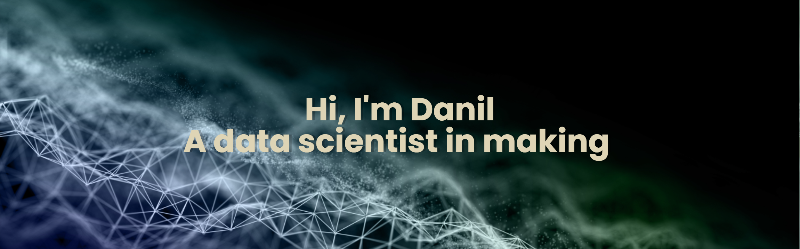

 I am a Skillfactory student in the Data Science direction. My specialized education consisted of system analysis, probability theory, mathematical statistics and efficiency assessment)✨ I like to solve interesting problems and study new technologies and approaches to solving them.💡  I try to improve in the use of new algorithms and clean coding👨🏻‍💻 

<h2 align="center">Technology Stack</h2>

<h2 align="center">
  My Github Stats
</h2>
 
 

  
  

<!--
**borrnbor/borrnbor** is a ✨ _special_ ✨ repository because its `README.md` (this file) appears on your GitHub profile.

Here are some ideas to get you started:

- 🔭 I’m currently working on ...
- 🌱 I’m currently learning ...
- 👯 I’m looking to collaborate on ...
- 🤔 I’m looking for help with ...
- 💬 Ask me about ...
- 📫 How to reach me: ...
- 😄 Pronouns: ...
- ⚡ Fun fact: ...
-->
